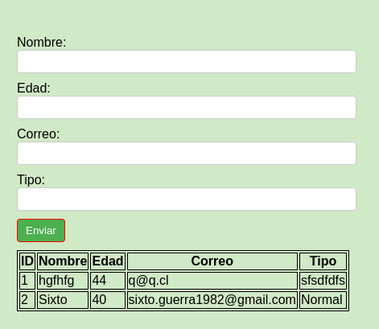

** 1) Crear función que reciba nombre de usuario y emita un saludo por
pantalla.

    Respuesta: se adjunta codigo en carpeta programa.

** 2) Crear formulario de 4 campos que valide al menos 2 tipos (solo letra, solo
números, alfanumérico, email, etc), guarde datos en bd y luego es
necesario mostrar los datos registrados por pantalla (a lo menos usar un
estilo css).

    Respuesta: 
    
        2.1) Se adjunta codigo y bd en carpeta programa_dos/my_project
        2.2) Proyecto realizado en Rails 5.2 con postgresql
        

        
        

** 3) ¿Qué herramienta usarías para generar un WS?

    Respuesta: Para generar un Web Service (WS) ,utilizaria algun framework como "Laravel" o "Symfony", 
    ya que seria una forma elegante y eficiente de crear y exponer servicios web con PHP.

** 4) ¿Qué función usaría para modificar la zona horaria de un datetime en una bd mysql?

    Respuesta: 
                CONVERT_TZ(datetime, from_tz, to_tz)

                Donde:

                (datetime)  -> es el valor de fecha y hora que deseas convertir.
                (from_tz) -> es la zona horaria actual del valor datetime.
                (to_tz) -> es la zona horaria a la que deseas convertir el valor datetime.

